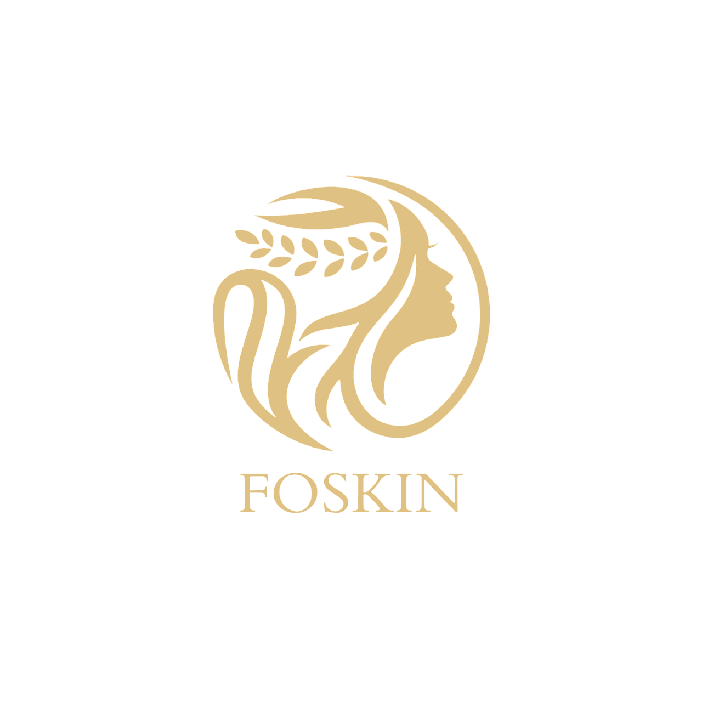

  

# C242-PS014 - Bangkit 2024 Batch 2 Capstone Team Project (FOSKIN)

Hello there! 👋 We are a team on a mission to transform skincare with AI-driven personalized acne solutions, empowering healthier, more confident skin.

## 📑 Project Overview

FOSKIN is an AI-powered mobile application designed to revolutionize skincare management, focusing specifically on acne solutions. By utilizing advanced AI detection, the app analyzes individual skin conditions and provides personalized recommendations tailored to each user's needs. FOSKIN serves as a digital skincare assistant, offering a seamless, accessible way to identify acne issues, recommend appropriate treatments, and guide users toward achieving healthier skin.

## 🌍 Why It Matters

Acne is a common struggle faced by millions of people around the world. For many, it’s more than just a skin issue—it affects their confidence, emotional well-being, and overall quality of life. Finding the right solution can be frustrating and overwhelming, as the causes of acne vary greatly from person to person. Generic skincare products often fail to deliver meaningful results, leaving users disheartened and uncertain about the best path forward.

This is where FOSKIN makes a difference. By harnessing the power of AI, the app goes beyond one-size-fits-all solutions, offering personalized insights tailored to each individual’s unique skin condition. No longer do users need to waste time and money on products that don’t work. Instead, they receive data-driven recommendations designed specifically for their needs, ensuring a targeted and effective approach to skincare.

## 👥 Meet Our Extraordinary Team

Let us introduce you to the masterminds behind this groundbreaking project. Each team member brings their unique expertise, unwavering dedication, and a shared passion for making a real impact.

| Learning Path                         | Bangkit ID    | GitHub Link                | LinkedIn Link                          |
|------------------------------|---------------|-----------------------|-----------------------------------|
| Machine Learning        | M505B4KY4128   | [Shawn Davies Sugianto](https://github.com/ShawndeSheep) | [Shawn Davies Sugianto](https://www.linkedin.com/in/shawn-davies-sugianto/)      |
| Machine Learning             | M193B4KY2821   | [Muhammad Farhan Fadhila](https://github.com/muhfarhanfadhila) | [Muhammad Farhan Fadhila](https://www.linkedin.com/in/muhfarhanfadhila/)      |
| Machine Learning             | M197B4KY4425   | [Vincent Alexander Purnomo](https://github.com/Rouinc) | [Vincent Alexander Purnomo](https://www.linkedin.com/in/vincent-purnomo-405092269/)      |
| Cloud Computing      | C193B4KY3317   | [Nendy Rafi Akmal Manik](https://github.com/nendyrafi0) | [Nendy Rafi Akmal Manik](https://www.linkedin.com/in/nendy-rafi-akmal-m-8abbb4286/)      |
| Cloud Computing | C213B4KY1757   | [Hela Dixman](https://github.com/heladixman) | [Hela Dixman](https://www.linkedin.com/in/heladixman/)      |
| Mobile Development    | A158B4KY2398   | [Marcello Ilham](https://github.com/Marcelloaja) | [Marcello Ilham](https://www.linkedin.com/in/marcelloilham/)      |

## 🚀 Project Branches

We've divided our project into distinct branches to ensure smooth development and organization. Here's a glimpse into each branch:

- **Machine Learning:** This branch focuses on developing the cutting-edge computer vision and machine learning algorithms that enable acne detection along with skincare detection
- **Mobile Android Development:** Here, we're crafting an intuitive and user-friendly Android application for our project.
- **Cloud Computing:** In this branch, you'll find the powerful backend code that enables seamless communication and data processing.

## 🤝 Get Involved

We welcome collaboration and contributions from the community! Whether you're a developer, domain expert, or just passionate about our mission, we'd love to hear from you. Join us in helping people glow up, overcome acne, and make a positive impact on the world!

## 📞 Contact Us

Have questions, ideas, or just want to say hello? Reach out to us through the following channels:

- Email: foksin.project@gmail.com
